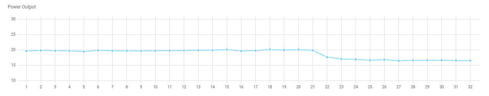

# This project is inactived in favor of [https://github.com/freddez/eplumber] 

# Long Life Charge (llcharge) : Battery threshold controller

Used in conjunction with a [smart plug](https://en.wikipedia.org/wiki/Smart_plug), this tool helps to [prolong](https://batteryuniversity.com/article/bu-808-how-to-prolong-lithium-based-batteries) your batteries' life, by automatically stopping charge at a power level threshold (ideally 80%).

Once configured, simply plug your device/battery on smart-plug and switch it on. Your device will be recognized, and the plug will be automaticaly switched off by llcharge when battery will reach pre-defined power threshold.

Written in _Rust_, this tool has a small power-memory footprint and can be run as a daemon on a _Raspberry Pi_ or equivalent.

## Requirements

- A device/battery provided with a **fast charger**. These smart chargers modulate power output,
  depending on battery power level: the power output of fast chargers decreases when
  battery reaches full charge. Your job is to detect that power output threshold to set up
  your devices.
- A smart plug. Currently, only [Shelly Plug](https://shelly.cloud/products/shelly-plug-s-smart-home-automation-device/) is supported. Next release could support [MQTT](https://en.wikipedia.org/wiki/MQTT) compatible devices.

## Installation

llcharge is designed to run as a daemon listening to your plug; in this way you'll only have to control your plug and forget llcharge. So the most classical way is to install llcharge on a Raspberry Pi or equivalent. You could also launch it on demand (see `power_on_on_startup` and `exit_after_poweroff` settings).

### Prebuilt package

Debian packages are provided for amd64 and armhf (Raspberry Pi). You could easily make your own with `cargo deb` [command](https://github.com/kornelski/cargo-deb).

### From source

Install [Rust](https://rustup.rs/), then

```sh
$ cargo build --release
```

## Setup

### Shelly plug

- Follow the manual to activate the plug on your wifi network. Set a static IP on your
  router for the device.
- Upgrade the plug to the latest version (should be >= 1.11.8). My plug was shipped with 1.0
  version, saying that my firmware was up to date. I had to force firmware upgrade with
  this [firmware archive link generator](http://archive.shelly-tools.de/).
- Saying that your smart-plug is running on `smartplug.local` and llcharge on
  `rpi.local:7000`, open your browser to `http://smartplug.local/` , and set in "actions" /
  "output switched on URL" :
  - enabled : true
  - URL to be hit when the output is switched ON : `http://rpi.local:7000/api/activate/`
- Once configured, _Shelly cloud_ is not needed.

### Devices

Plug your uncharged device into your plug and watch power consumption. You will have to detect :

- max power
- power threshold : when your device reaches 80% power charge
- min power

Max and min power are needed to identify your device and activate threshold detection. If you plan to use multiple devices with one plug, keep in mind that a plugged device will not be switched off until power output is between multiple boundaries.

### llcharge settings

If installed from source, `llcharge.toml` default configuration will be installed on initial launch on default user directory, depending on your [OS](https://crates.io/crates/directories). Otherwise, with deb package, edit `/etc/llcharge.toml`. With the shipped sample, configuration parameters should be self-explanatory.

With `/etc/systemd/system/llcharge.service`, start llcharge with

```sh
$ sudo systemctl start llcharge.service
```

## Usage

### Daemon mode

Keep llcharge launched on one of your local computers, and press the power button on the plug after plugging your battery, until llcharge switch off the plug. You can monitor llcharge by watching syslog.

### Manual launch mode

Apply these settings on llcharge.toml :

```
power_on_on_startup = true
exit_after_poweroff = true
```

Then launch llcharge after plugging your battery.

## Monitoring

A basic real-time chart is provided to help device setup, on `http://rpi.local:7000/`.



## TODO

- [x] Monitor Shelly Plug Output, power off on low power consumption threshold.
- [x] Record sample
- [x] Supports configuration file
- [x] Web interface with chart display
- [x] Multiple devices support
- [x] Debug level in config file
- [ ] Device status in web interface
- [ ] Longer web stats to help monitor power threshold
- [ ] Move all remaining constants to config
